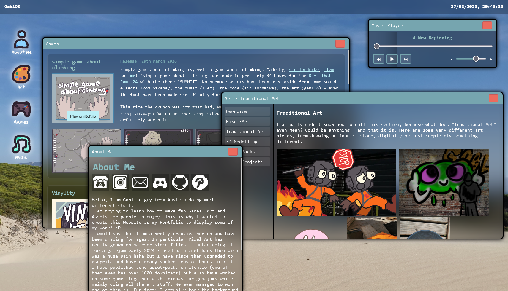

# GablOS 
A OS-like Website created for Hackclub Stardance with following the guide to it.

By following the guide I could get to know some javascript and go more in depth with css and html. 
This Website is a bit of a personal site or portfolio that has like a really interesting desing because it's not like the usual website but built up like a simple OS that has clickable App icons that open windows and such.

[www.gabl.works](www.gabl.works)

Features:
* Top-Bar that displays Time
* Welcome Screen
* About Me with Social links
* Art with much different Art created by me
* Games - display of games I have worked on
* Music Player - plays some songs friends made or that got used in games